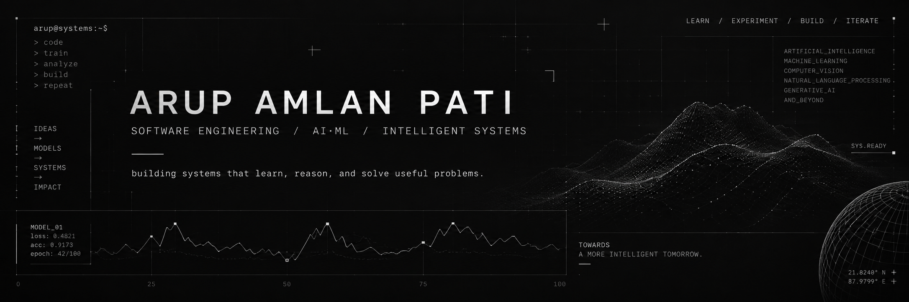

<p align="center">
  
</p>

<br>

<div align="center">

<code>software engineering</code>
  ·   <code>artificial intelligence</code>
  ·   <code>machine learning</code>
  ·   <code>intelligent systems</code>

</div>

<br>

### `// about`

I build things around **machine learning, intelligent systems and software engineering**.

Interested in understanding what happens beneath the abstraction — from **model architectures and data pipelines** to **APIs and working applications**.

Currently experimenting, shipping, breaking things, and rebuilding them better.

```text
arup@systems:~$ status

> learning
> building
> experimenting
> repeat_
```

---

### `// engineering stack`

```text
LANGUAGES     Python · C/C++ · SQL · JavaScript

AI / ML      PyTorch · TensorFlow · scikit-learn
             Hugging Face · Transformers

VISION       OpenCV · CNN · Vision Transformers · Grad-CAM

GEN AI       LangChain · RAG · Ollama · Vector Search

BACKEND      Flask · FastAPI · Streamlit

DATA         NumPy · Pandas · Matplotlib

TOOLS        Git · GitHub · VS Code · Google Colab
```

---

### `// selected work`

<table>
<tr>
<td width="50%" valign="top">

#### `01 / NLP Summarization Suite`

Transformer-based system for configurable text and document summarization.

`Python` `Transformers` `Hugging Face` `NLP`

<br>

<a href="https://github.com/ArupAmlan/Text_summerizer">
  <b>→ explore repository</b>
</a>

</td>

<td width="50%" valign="top">

#### `02 / Multi-Teacher Distillation`

Research-oriented exploration of efficient knowledge transfer using multiple teacher models and vision-language architectures.

`PyTorch` `Deep Learning` `KD` `VLM`

<br>

<sub>repository / coming soon</sub>

</td>
</tr>

<tr>
<td width="50%" valign="top">

#### `03 / Scam Detection`

NLP-based system for identifying suspicious and fraudulent messages with an application/API layer.

`Python` `NLP` `TF-IDF` `ML` `Flask`

<br>

<sub>repository / coming soon</sub>

</td>

<td width="50%" valign="top">

#### `04 / Cloud Motion Prediction`

Spatiotemporal deep-learning experiments for forecasting cloud movement from sequential satellite imagery.

`ConvLSTM` `Computer Vision` `Deep Learning`

<br>

<sub>repository / coming soon</sub>

</td>
</tr>
</table>

---

### `// current process`

```text
[01]  LEARN       →  DSA · AI systems · engineering fundamentals

[02]  BUILD       →  applied ML · GenAI · intelligent applications

[03]  EXPERIMENT  →  agents · multimodal AI · efficient models

[04]  ITERATE     →  build → break → understand → rebuild
```

---

### `// github telemetry`

<p align="center">
  
  
</p>

<br>

<p align="center">
  <code>─────────────────────── SYSTEM / ACTIVITY ───────────────────────</code>
</p>

<br>

### `// connect`

<p align="center">

<a href="https://github.com/ArupAmlan"><code>GITHUB</code></a>
    /     <a href="YOUR_LINKEDIN_URL"><code>LINKEDIN</code></a>
    /     <a href="mailto:YOUR_EMAIL"><code>EMAIL</code></a>

</p>

<br>

<p align="center">
  <sub>
    <code>IDEAS → MODELS → SYSTEMS → IMPACT</code>
  </sub>
</p>

<p align="center">
  <sub>build. break. understand. rebuild.</sub>
</p>
